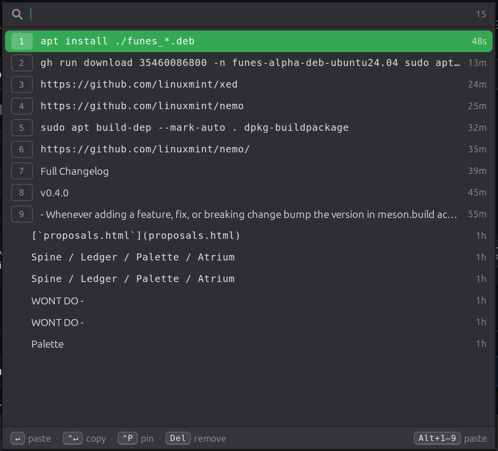

<p align="center">
  
</p>

<h1 align="center">Funes</h1>

<p align="center">
  <em>Clipboard history that never forgets.</em><br>
  A fast, keyboard-first clipboard manager for Linux desktops, built with Python, GTK 3 and libxapp.
</p>

<p align="center">
  <a href="https://github.com/lt-mayonesa/funes/actions/workflows/ci.yml"></a>
</p>

<p align="center">
  <a href="#installation">Installation</a> ·
  <a href="#usage">Usage</a> ·
  <a href="#configuration">Configuration</a> ·
  <a href="#how-it-works">How it works</a> ·
  <a href="#contributing">Contributing</a>
</p>

<p align="center">
  
</p>

<!--
Extra screenshots welcome, e.g.:
  docs/screenshot-tray.png      tray icon and its menu
  docs/screenshot-settings.png  settings dialog
-->

Funes keeps everything you copy, and lets you find it again with a keystroke.
Press <kbd>Super</kbd>+<kbd>V</kbd>, type a few characters, hit <kbd>Enter</kbd>,
and the text is pasted into the window you were working in.

The name comes from Borges' *Funes el memorioso*, about a man incapable of
forgetting.
The design is inspired by [Maccy](https://github.com/p0deje/Maccy) on macOS.

## Features

- **Instant search.** Case-insensitive substring filtering over the whole history.
- **Keyboard-first.** Open, filter, select and paste without touching the mouse.
- **Pinned items.** Keep snippets at the top; they are never evicted.
- **Pastes where you were.** The previously focused window is refocused and the
  paste keystroke injected, so it works in terminals, editors and browsers alike.
- **Survives the source app.** Funes takes ownership of the clipboard, so text
  stays available after the application you copied from is closed.
- **Image support.** Screenshots and copied images are captured with thumbnails, searchable by OCR text when Tesseract is installed. SVG copies (e.g. from Inkscape) are kept as vector data end to end — never rasterized — with a rendered thumbnail when librsvg is installed.
- **File copy/cut support.** Copying or cutting files in Nemo/Nautilus/Files shows up with a cut/copy icon and filenames, and pastes back as actual files.
- **Never silently drops a format.** Any clipboard content Funes doesn't have a dedicated presentation for yet is still fully captured and pasteable as a generic entry, instead of vanishing.
- **Password-manager aware.** Entries flagged as secrets are never stored.
- **Native and light.** Python/GTK 3 with a libxapp tray icon; no Electron,
  no background polling, no runtime helper tools.
- **Local only.** History lives in one SQLite file in your home directory.
  Nothing leaves the machine.

## Requirements

- An **X11** session (see [Limitations](#limitations) for Wayland).
- Python 3.10+, PyGObject, GTK 3.22+, libxapp 2.0+, python3-xlib.
- Cinnamon for automatic global-shortcut registration; other desktops work but
  need the shortcut bound manually.

Funes is developed on Linux Mint / Cinnamon and should run on any GTK 3 desktop
with a system tray.

## Installation

### From a release package

Every release publishes a `.deb` on the
[releases page](https://github.com/lt-mayonesa/funes/releases). The package is
`Architecture: all`, so the same file installs on Ubuntu 24.04 (Mint 22.x) and
Ubuntu 22.04 (Mint 21.x):

```sh
sudo apt install ./funes_0.2.0_all_ubuntu24.04.deb
```

`SHA256SUMS` is attached to each release for verification.

### From source

```sh
# Debian / Ubuntu / Linux Mint
sudo apt install meson ninja-build gettext \
                 python3-gi python3-xlib python3-xapp python3-setproctitle \
                 gir1.2-gtk-3.0 gir1.2-xapp-1.0 xapp-symbolic-icons

git clone https://github.com/lt-mayonesa/funes.git
cd funes
meson setup _build --prefix=/usr
sudo meson install -C _build
```

Then start it once; it registers its global shortcut and autostart entry on
first run:

```sh
funes
```

### Running without installing

```sh
./scripts/run.sh
```

This compiles the GSettings schema into `_build/data` and runs the application
straight from the source tree. `./test-funes` instead installs the working tree
over the system copy and restarts Funes, the way xapp projects are usually
developed.

## Usage

```
funes              start the tray daemon
funes toggle       show/hide the history popup
funes show         show the history popup
funes clear        clear the history (pinned items are kept)
funes settings     open the settings dialog
funes quit         stop the running instance
funes --version    print the version
```

Only one instance runs at a time. Subsequent commands are delivered to it over
D-Bus, and will start it if it is not running.

### Global shortcut

Default: <kbd>Super</kbd>+<kbd>V</kbd>.

On Cinnamon the shortcut is registered as a custom keybinding that runs
`funes toggle`, so it is visible and editable in *Keyboard → Shortcuts →
Custom Shortcuts*, and works even when Funes is not running. On other desktops,
bind `funes toggle` to a key of your choice in the system settings.

### Popup

| Key | Action |
| --- | --- |
| type | filter the history |
| <kbd>↑</kbd> / <kbd>↓</kbd> | move the selection |
| <kbd>PgUp</kbd> / <kbd>PgDn</kbd> | move ten rows |
| <kbd>Alt</kbd>+<kbd>1</kbd>…<kbd>9</kbd> | paste the numbered row |
| <kbd>Ctrl</kbd>+<kbd>Alt</kbd>+<kbd>1</kbd>…<kbd>9</kbd> | copy the numbered row, without pasting |
| <kbd>Enter</kbd> | copy and paste into the previously focused window |
| <kbd>Ctrl</kbd>+<kbd>Enter</kbd> | copy only |
| <kbd>Ctrl</kbd>+<kbd>P</kbd> | pin / unpin the selected item |
| <kbd>Delete</kbd> | remove the selected item |
| <kbd>Ctrl</kbd>+<kbd>L</kbd> | clear the history (pinned items are kept) |
| <kbd>Ctrl</kbd>+<kbd>,</kbd> | close the popup and open Preferences |
| <kbd>Esc</kbd> | close |

The popup opens centered on the monitor under the pointer and closes when it
loses focus.

### Tray icon

Left click opens the popup. Right click opens a menu with *Open Funes*,
*Clear History*, *Preferences* and *Quit*.

## Configuration

Settings are stored in GSettings under `org.x.funes` and can be edited in
the settings dialog (`funes settings`), with `gsettings`, or with
`dconf-editor`.

| Key | Default | Description |
| --- | --- | --- |
| `history-size` | `200` | Maximum number of unpinned items. |
| `hotkey` | `<Super>v` | Global shortcut that toggles the popup. Captured by pressing the combination in Settings; applied live. Empty disables it. |
| `paste-on-select` | `true` | Inject the paste keystroke after copying. |
| `paste-ctrl-v-class-regex` | `''` | Windows whose `WM_CLASS` matches this regex are pasted with <kbd>Ctrl</kbd>+<kbd>V</kbd> instead of <kbd>Shift</kbd>+<kbd>Insert</kbd>. |
| `paste-sets-primary` | `true` | Also set the PRIMARY selection when pasting. |
| `reown-clipboard` | `true` | Take clipboard ownership so copies outlive the source application. |
| `launch-at-login` | `true` | Manage `~/.config/autostart/org.x.funes.desktop`. |
| `popup-width` / `popup-height` | `640` / `420` | Popup size in pixels. |
| `remember-size` | `true` | Persist the popup size after resizing. |
| `popup-single-click-activates` | `false` | One click copies the row immediately. Off, a single click only selects and a double click activates, so clicking inside the popup does not close it. |
| `popup-monitor-order` | `['focused','pointer','primary']` | Rules tried in order to pick the monitor the popup opens on: monitor of the previously focused window, monitor under the pointer, primary monitor. Sortable in Settings. X11 only. |
| `max-item-bytes` | `1048576` | Ignore clipboard text larger than this. |
| `ignore-enabled` | `false` | Pause capturing without quitting. |
| `ignore-regexes` | `[]` | Never store text matching any of these regexes. |

Examples:

```sh
# Keep more history
gsettings set org.x.funes history-size 1000

# Use a different shortcut
gsettings set org.x.funes hotkey '<Shift><Super>c'

# Paste with Ctrl+V in specific applications (regex on "res_name.res_class")
gsettings set org.x.funes paste-ctrl-v-class-regex 'Chromium|jetbrains'

# Never store anything that looks like an AWS key
gsettings set org.x.funes ignore-regexes "['AKIA[0-9A-Z]{16}']"
```

## Privacy and security

History is stored at `$XDG_DATA_HOME/funes/history.db` (usually
`~/.local/share/funes/history.db`), a SQLite database created with mode `0600`
inside a `0700` directory. **It is not encrypted**: anything you copy stays on disk until it is
evicted, unpinned and pushed out by newer entries, or explicitly removed.

Funes refuses to store an entry when:

- the clipboard advertises a password-manager hint
  (`x-kde-passwordManagerHint`, `text/x-kde-passwordManagerHint`,
  `org.nspasteboard.ConcealedType`), which KeePassXC, Bitwarden, Firefox and
  others set when copying a password;
- the text is empty or whitespace only;
- the text is larger than `max-item-bytes`;
- the text matches one of your `ignore-regexes`.

Use `ignore-enabled` (*Pause capturing* in the settings dialog) to stop
recording temporarily, and `funes clear` to wipe the history.

## How it works

| Concern | Implementation |
| --- | --- |
| Clipboard watch | `Gtk.Clipboard::owner-change`, which is XFixes-driven on X11 — event based, no polling loop. |
| Clipboard persistence | After capturing, Funes claims ownership of the selection, because X11 clipboard contents die with the owning client. |
| Storage | SQLite (WAL, `synchronous=NORMAL`), written through on every change; the whole history is mirrored in memory for instant filtering. |
| Tray | `XAppStatusIcon`, which talks to the Cinnamon applet over D-Bus and falls back to `Gtk.StatusIcon` elsewhere. |
| Global shortcut | Cinnamon custom keybinding invoking `funes toggle`; D-Bus activation starts the daemon if needed. |
| Paste | In-process XTEST key injection through `python3-xlib`, no external tools. |

### Pasting

Pasting into another application on X11 means synthesizing a keystroke, which
requires some care:

1. The target window is remembered from `_NET_ACTIVE_WINDOW` *before* the popup
   takes focus.
2. After an item is chosen, Funes waits for that window to regain focus and
   raises it if the window manager did not (`_NET_ACTIVE_WINDOW` client message,
   `XRaiseWindow`, `XSetInputFocus`).
3. It then waits for every keyboard modifier to be released — the global
   shortcut means <kbd>Super</kbd> is probably still held, which would turn the
   injected keystroke into something else.
4. Finally it fakes <kbd>Shift</kbd>+<kbd>Insert</kbd> through XTEST.

<kbd>Shift</kbd>+<kbd>Insert</kbd> is used rather than
<kbd>Ctrl</kbd>+<kbd>V</kbd> because VTE-based terminals (GNOME Terminal,
Terminator, xfce4-terminal, …) do not paste on <kbd>Ctrl</kbd>+<kbd>V</kbd>,
while <kbd>Shift</kbd>+<kbd>Insert</kbd> is understood by GTK, Qt, VTE and
browsers. Terminals read <kbd>Shift</kbd>+<kbd>Insert</kbd> from the PRIMARY
selection, so activating an item sets both CLIPBOARD and PRIMARY by default;
turn `paste-sets-primary` off if you would rather keep your mouse selection.
Applications that want <kbd>Ctrl</kbd>+<kbd>V</kbd> can be listed in
`paste-ctrl-v-class-regex`.

This strategy follows [CopyQ](https://github.com/hluk/CopyQ), which solved the
same problems on X11.

## Limitations

- **X11 only.** Under Wayland, clipboard monitoring is limited and XTEST only
  reaches XWayland clients, so paste-on-select is disabled and Funes warns once.
  Popup placement (`popup-monitor-order`) is ignored too: GTK3 cannot position
  toplevels on Wayland. A `wlr-data-control`/portal backend is planned; the
  platform code is isolated in `app/clipboard.py` and `funes/paster.py`, and
  the port is tracked in [`docs/design/WAYLAND.md`](docs/design/WAYLAND.md).
- **Wayland clipboard.** Image and text capture under Wayland is limited to windows that have focus; see `docs/design/WAYLAND.md`.
- **One clipboard manager at a time.** Running Funes alongside CopyQ, Klipper,
  GPaste or Diodon makes them fight over clipboard ownership. Disable the others.
- Automatic shortcut registration is Cinnamon-specific.

## Roadmap

- Full-text search over the SQLite history (FTS5)
- Image and rich-text entries
- Wayland support
- Fuzzy search and item preview
- Per-application ignore rules

## Contributing

Issues and pull requests are welcome.

```sh
meson setup _build --prefix=/usr
meson test -C _build      # unittest discover over tests/
./scripts/run.sh          # run from the source tree
./test-funes              # install over the system copy and restart
./scripts/check.sh        # everything CI runs (needs uv)
```

CI runs on every push and pull request: `ruff format --check`, `ruff check`,
`mypy --strict`, `bandit`, `meson test` on Ubuntu 24.04 and 22.04, desktop-entry
and GSettings-schema validation, a `.deb` build and `lintian --fail-on error`.
Green pushes to `main` refresh the rolling [`beta`
pre-release](https://github.com/lt-mayonesa/funes/releases/tag/beta); pull
requests get an alpha `.deb` linked in a PR comment.

### Releasing

See [docs/RELEASING.md](docs/RELEASING.md) for the full flow (channels, version
ordering, apt roadmap). Short version:

1. Bump `version:` in `meson.build`, commit and push; let CI go green.
2. Create the release on GitHub (UI → *Releases* → *Draft a new release*, or
   `gh release create v0.2.0 --generate-notes`), writing the notes there. The
   tag must match `meson.build`, prefixed with `v`.
3. Publishing it triggers the `Release` workflow, which refuses to ship a commit
   without a successful CI run, rebuilds the package from the tag with the clean
   release version, and attaches the `.deb` and `SHA256SUMS`. Only one deb is
   published — it is `Architecture: all` and installs on both bases. The
   workflow never touches the notes or the prerelease flag.

Project layout:

```
funes/                      shared, GTK-free modules (installed to dist-packages)
  item.py                   a single history entry
  store.py                  SQLite history: dedup, pinning, cap, eviction
  config.py                 GSettings wrapper
  filters.py                capture rules (secrets, size, ignore regexes)
  presentation.py           row heuristics: relative age, monospace, matches
  paster.py                 XTEST keystroke injection and window focus handling
  accel.py                  accelerator parsing, validation and labels
  hotkey.py                 global shortcut registration
  autostart.py              launch at login
app/                        the GTK application (installed to /usr/share/funes)
  funes_app.py              Gtk.Application entry point and CLI verbs
  clipboard.py              clipboard watch, secret filtering, re-owning
  popup.py                  history popup
  shortcut.py               shortcut capture row used by Preferences
  theming.py                Funes stylesheet on top of the system theme
  tray.py                   tray icon and menu
  preferences.py            preferences window (XApp.PreferencesWindow + xapp GSettings widgets)
data/                       GSettings schema, desktop entry, launcher, man page
po/                         translations
tests/                      unittest suite
debian/                     Debian packaging (dh + meson buildsystem)
scripts/check.sh            the full CI check set, runnable locally
docs/RELEASING.md           SDLC: alpha/beta/release channels
.github/workflows/          CI and release pipelines
```

Guidelines: keep GTK out of `funes/` so the core stays testable headless, follow
the xapp-project conventions this repository mirrors (PEP 8, 4 spaces, no
external runtime dependencies beyond the Debian-packaged ones), and add tests
for storage or history-semantics changes.

## Credits

- [Maccy](https://github.com/p0deje/Maccy) — the interaction model this project
  imitates.
- [CopyQ](https://github.com/hluk/CopyQ) — reference for reliable X11 pasting.
- [xapp](https://github.com/linuxmint/xapp) — tray integration.

## License

GPL-3.0-or-later. See [COPYING](COPYING).
